# 图书借阅管理系统

### 有问题， 或者不会调试的，可以添加微信：xzxj0206

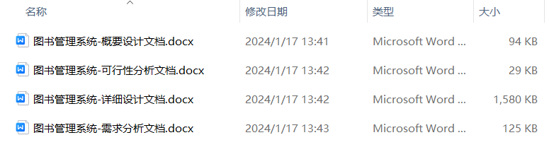

## 一、项目介绍

基于Springboot+vue的前后端分离图书借阅管理系统

技术：JAVA、 SpringBoot、MyBatis、MySQL、 Vue

【功能介绍】

本图书借阅管理系统的功能，主要是后端管理系统，角色就分为普通用户和管理员两大角色，

主要功能包括：图书信息管理、图书类别管理、借阅信息管理、用户管理、修改密码、用户借书、用户还书。

## 二、系统运行界面

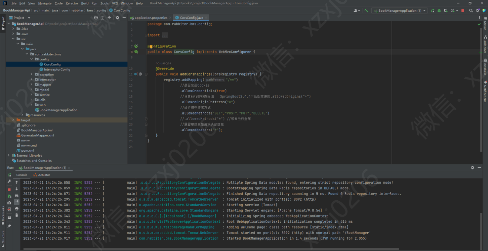

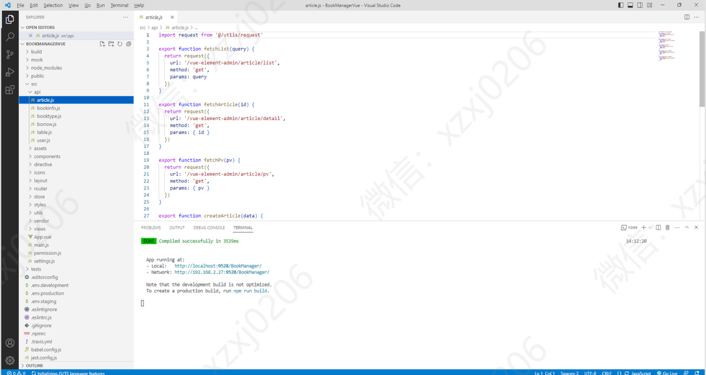

## 三、管理员功能界面展示

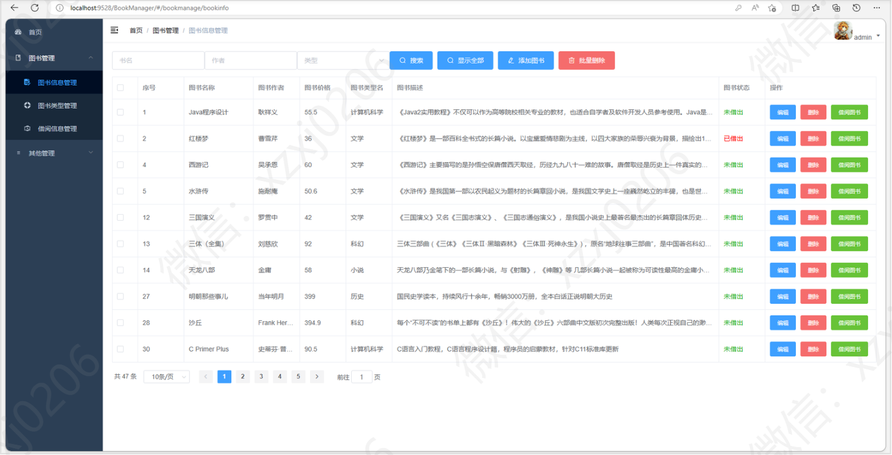

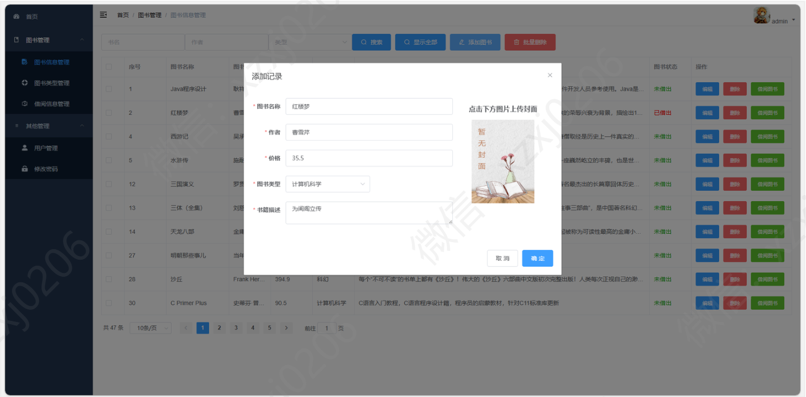

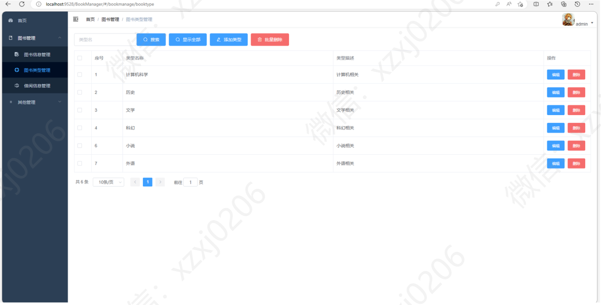

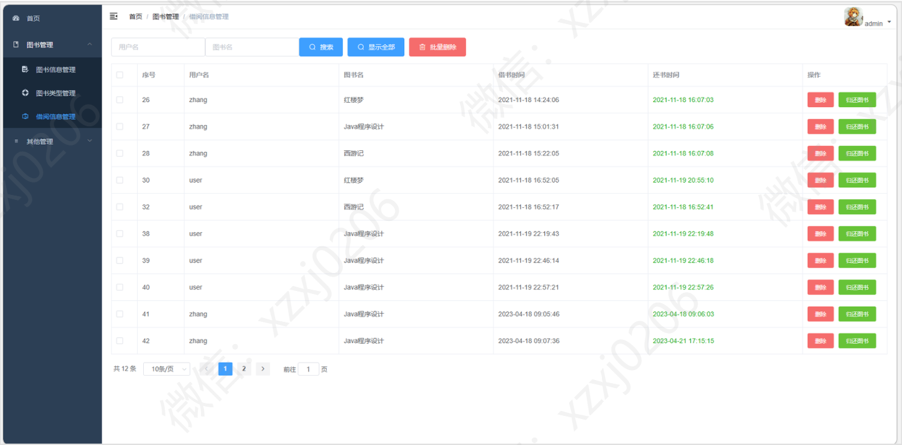

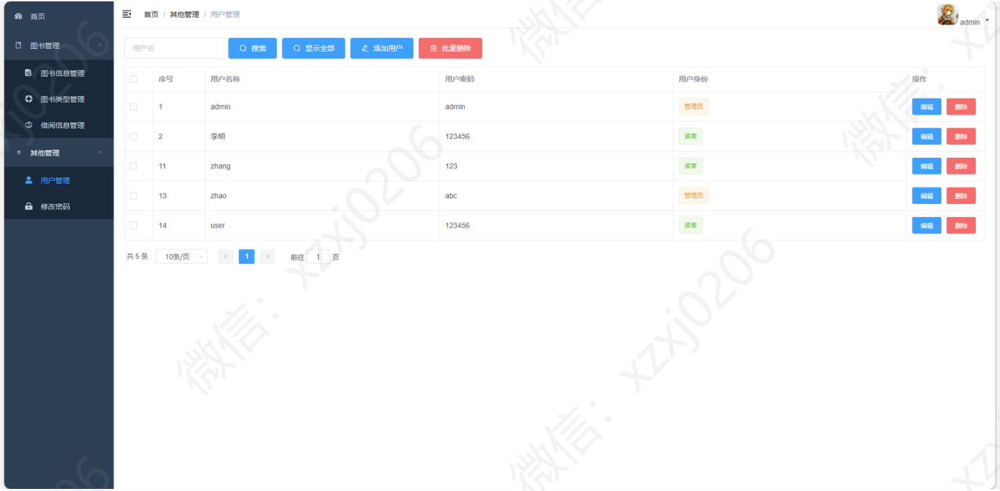

## 四、用户功能界面展示

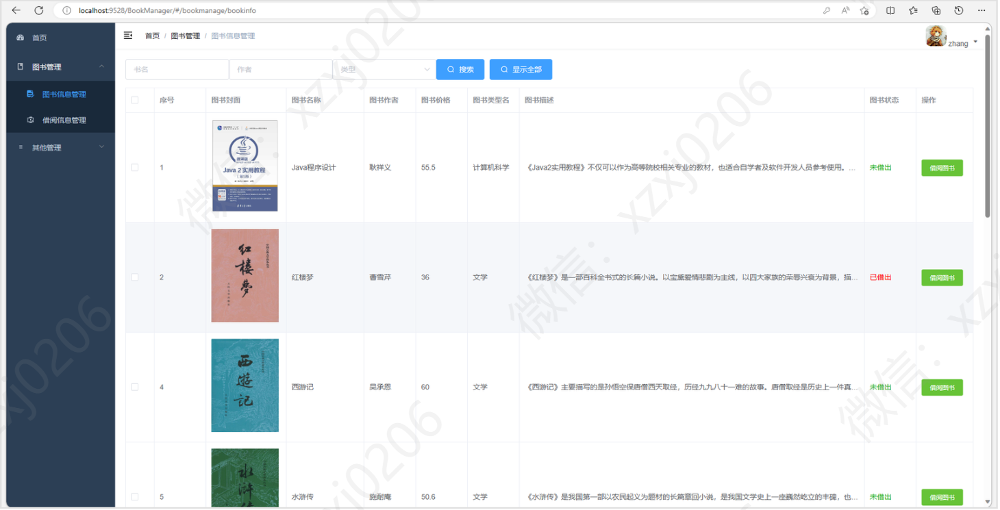

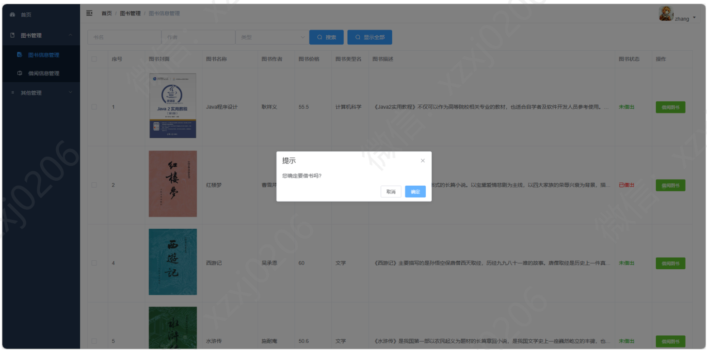

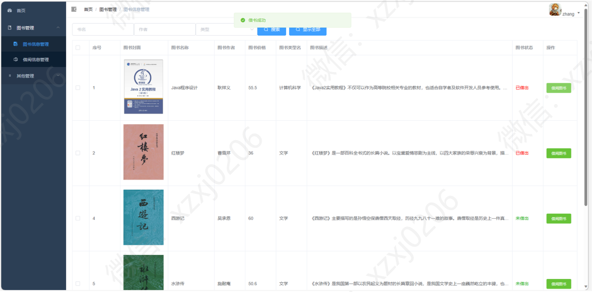

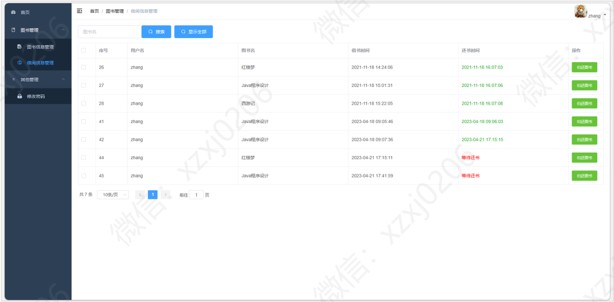
