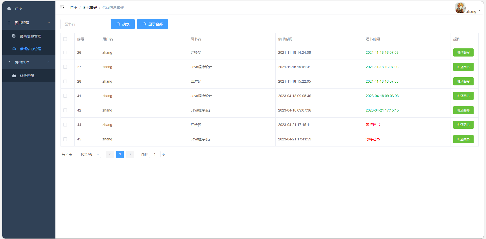
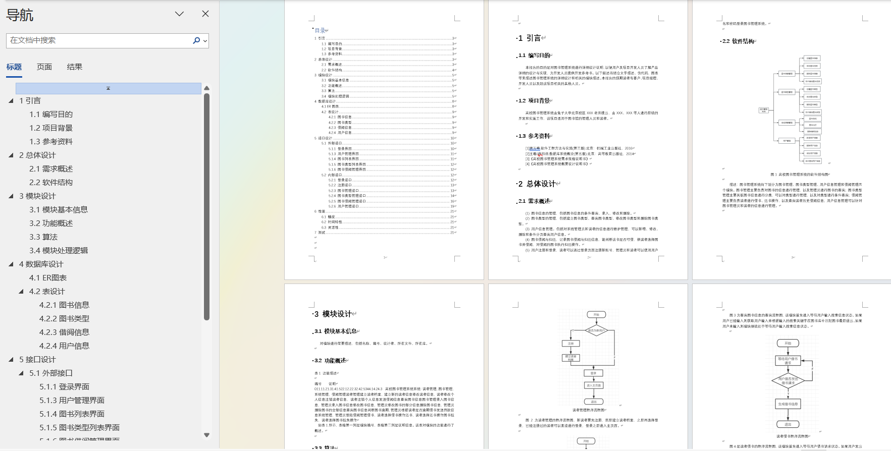

# 图书借阅管理系统

### 9.9￥ 获取完整源码+sql，附赠11000字论文参考，需要加Q：3808981644 备用Q：3577148218
### 有问题，或者需要协助调试运行项目的也可联系

## 一、项目介绍

基于Springboot+vue的前后端分离图书借阅管理系统

开发语言：java

运行环境:idea或eclipse vscode 数据库:mysql

技术：JAVA、 SpringBoot、MyBatis、MySQL、 Vue

【功能介绍】

本图书借阅管理系统的功能，主要是后端管理系统，角色就分为普通用户和管理员两大角色，

主要功能包括：图书信息管理、图书类别管理、借阅信息管理、用户管理、修改密码、用户借书、用户还书。

## 二、部分功能界面展示

## 三、万字文档参考

## 四、 9.9￥ 获取完整源码+sql，附赠11000字论文参考，需要加Q：3808981644 备用Q：3577148218
## 有问题，或者需要协助调试运行项目的也可联系

